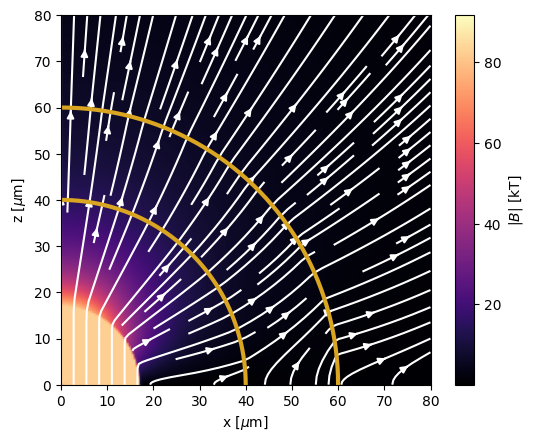

# field_compression 

Mini-app for computing the evolution of arbitrary 3D magnetic fields under spherical flows (expanding or compressing). Based on our (soon to be) published work ([arXiV link](https://arxiv.org/abs/2503.00186)), which derives the evolved magnetic field based only on the initial/final fluid positions and the initial magnetic field.

## Installation

Prerequisites: install python (>=3.9), numpy, scipy, and matplotlib

Clone this repository onto your system: 

`git clone https://github.com/spiersrobbie/field_compression.git`

Navigate to this directory (with the requirements.txt file in it) and perform 

`pip install .` 

You should now be able to `import field_compression` to any python script!

## Example usage: Compute axial field compression given density profiles

The following code will demonstrate the compression of an axial starting magnetic field for a N210808-like capsule. The initial and final density profiles are both given, simply as step profiles for this example.

### 1 - Import field_compression
```
from field_compression import FieldCompression, create_mesh, capsule_maker
import numpy as np 
import matplotlib.pyplot as plt
```

### 2 - Create the initial density profile using the capsule maker
`r0, den0 = capsule_maker([960, 1100, 1300], [4.5e-4, 0.25, 0.01])`

$$ 
\rho_0(r) = \begin{cases}
   4.5 \cdot 10^{-4} \ \mathrm{g/cm^3} &\text{if } \ 0 \leq r < 960 \ \mathrm{\mu m} \\
   0.25 \ \mathrm{g/cm^3} &\text{if } \ 960 \leq r < 1100 \ \mathrm{\mu m} \\
   0.01 \ \mathrm{g/cm^3} &\text{if } \ 1100 \leq r < 1300 \ \mathrm{\mu m}
\end{cases}
$$

### 3 - Create final density profile 

`rf, denf = capsule_maker([40, 60, 120], [80, 200, 20])`

$$ 
\rho_f(r) = \begin{cases}
   80 \ \mathrm{g/cm^3} &\text{if } \ 0 \leq r < 40 \ \mathrm{\mu m} \\
   200 \ \mathrm{g/cm^3} &\text{if } \ 40 \ \mathrm{\mu m} \leq r < 60 \\
   20 \ \mathrm{g/cm^3} &\text{if } \ 60 \ \mathrm{\mu m} \leq r
\end{cases}
$$

### 4 - Initialize the field compression structure

`shot = FieldCompression(r0, rf, den0, denf, mode='profile')`

### 5 - Set up the initial axial field 

Create 2D $(r,\theta)$ mesh with 200 evenly spaced grid points from $0 \leq r < 1200 \ \mathrm{\mu m}$, and 100 evenly spaced grid points from $0 \leq \theta < 2 \pi$. This becomes a 2D mesh by specifying only 1 grid point in the $\varphi$ direction.

`B0mesh = create_mesh([[0, 1200], [0, 2*np.pi], [0, 0]], [200, 100, 1], 'spherical')`

Create an axial $\vec{B} = 26.1 \ \text{T} \ \hat{z}$ field on this mesh.

```
Bz = 26.1 * np.ones(B0mesh.coords['spherical'][0].shape)
B0mesh.attach_field((0*Bz, 0*Bz, Bz), 'cartesian')
```

### 6 - Evaluate the compressed magnetic field on a new mesh

Create 2D Cartesian $(x, z)$ mesh with $0 \leq x < 80 \ \mathrm{\mu m}$ and $0 \leq  < 80 \ \mathrm{\mu m}$.

`finalmesh = create_mesh([[0, 80], [0, 0], [0, 80]], [200, 1, 200], 'cartesian')`

Compute the field on this mesh.

```
Bfmesh = shot.evaluate(B0mesh, finalmesh)
x, _, z = (v.squeeze() for v in Bfmesh.coords['cartesian'])
Bx, _, Bz = (v.squeeze() for v in Bfmesh.field['cartesian'])
```

### 7 - Plot the magnetic field

```
im = plt.pcolormesh(x, z, np.sqrt(Bx**2 + Bz**2)/1000, cmap='magma', shading='gouraud')
plt.streamplot(x[:,0], z[0,:], Bx.T, Bz.T, color='w')
th = np.linspace(0, np.pi/2, 50)
plt.plot(40*np.sin(th), 40*np.cos(th), '-', color='goldenrod', lw=3)
plt.plot(60*np.sin(th), 60*np.cos(th), '-', color='goldenrod', lw=3)
plt.xlim(0, 80)
plt.ylim(0, 80)
plt.gca().set_aspect('equal')
cbar = plt.colorbar(im)
cbar.set_label('$|B|$ [kT]')
plt.xlabel(r'x [$\mu$m]')
plt.ylabel(r'z [$\mu$m]')
plt.show()
```

